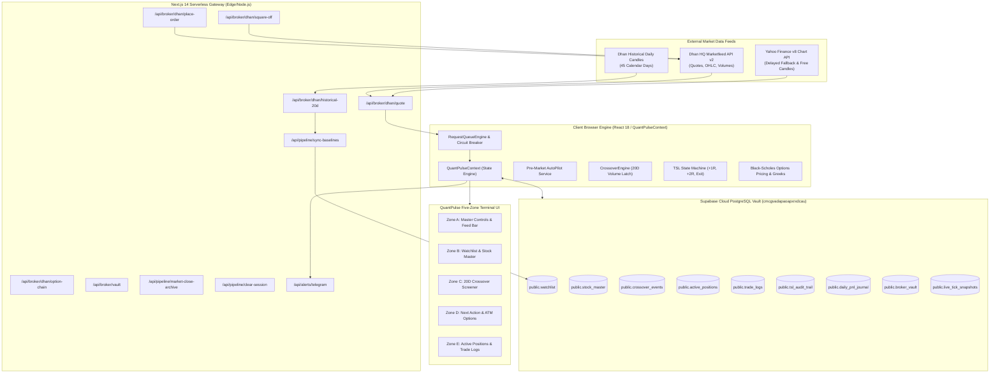
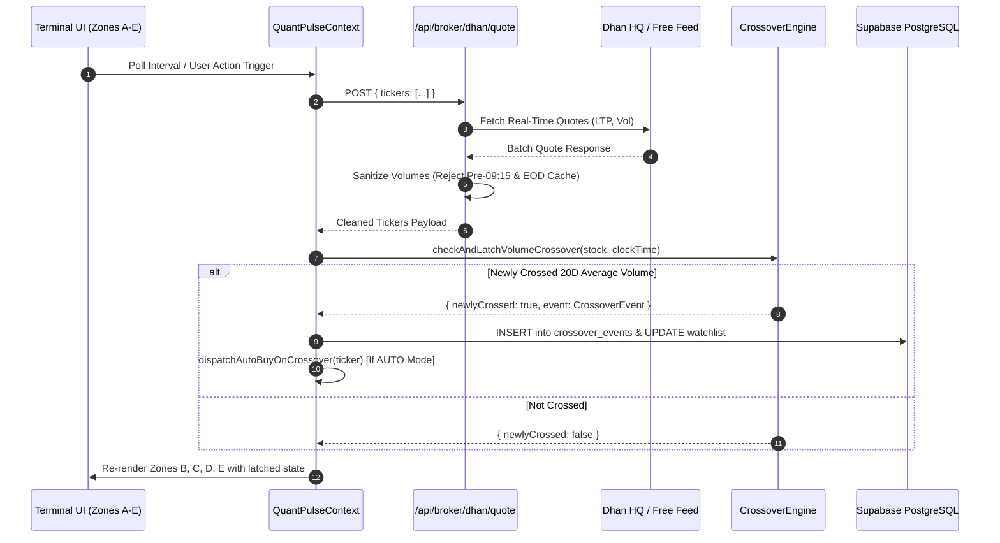
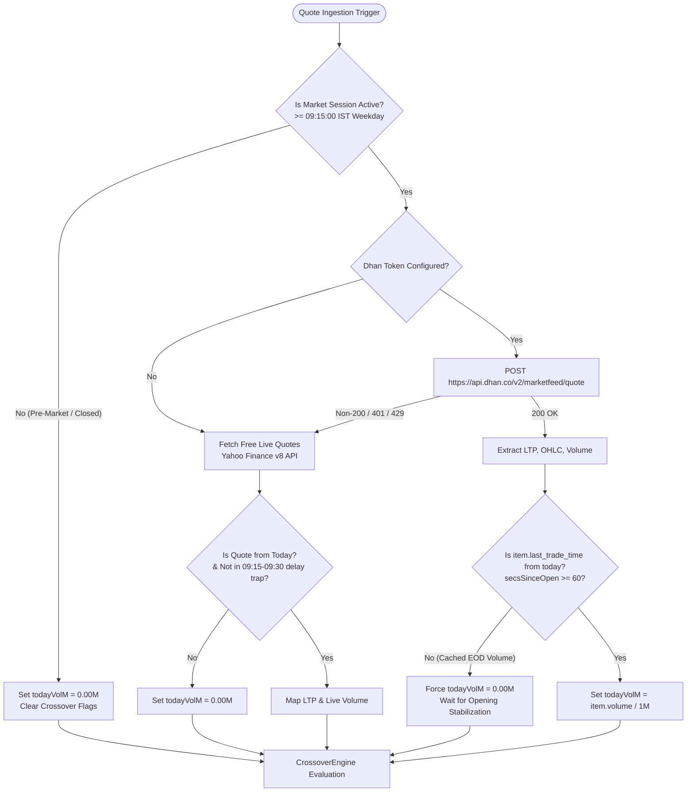
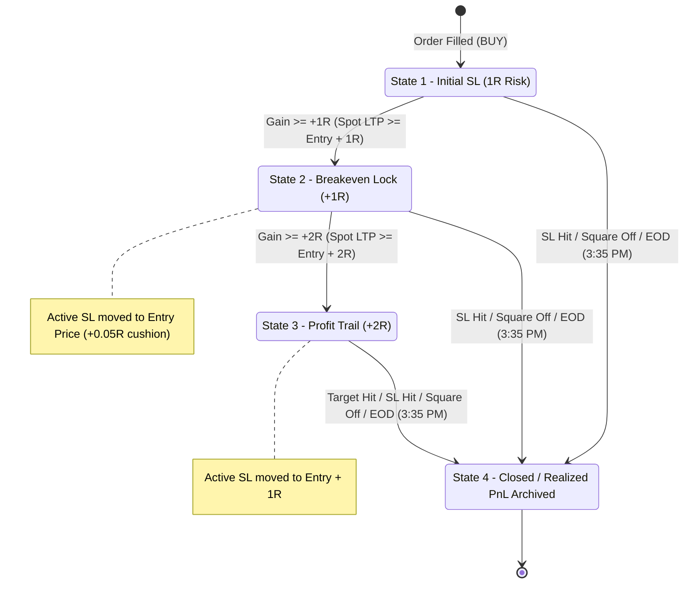
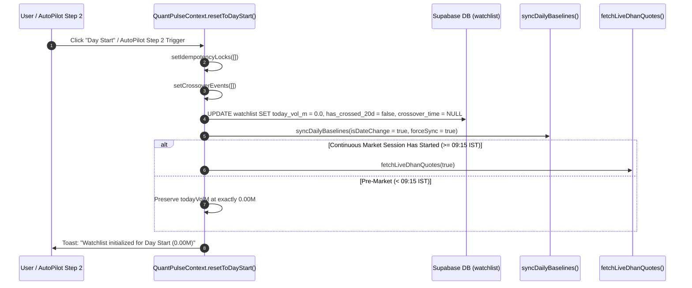
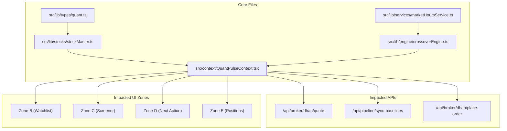

# APPLICATION BIBLE — QUANTPULSE SYSTEM SPECIFICATION
**Version:** 2.0.0  
**Target Repository:** `QUANTPULSE`  
**System Designation:** 20-Day Cumulative Volume Crossover & Options Execution Terminal  
**Timezone Baseline:** Indian Standard Time (IST, UTC+05:30)  
**Primary Exchange:** National Stock Exchange of India (NSE)  
**Target Architecture:** Next.js 14 App Router, TypeScript 5, Tailwind CSS, Supabase Cloud PostgreSQL, Dhan HQ Open API v2  
**Document Status:** SINGLE SOURCE OF TRUTH (SSOT)  

---

## 1. Executive Summary

QuantPulse is an institutional-grade, low-latency intraday momentum and breakout execution terminal for Indian equities (NSE) and derivatives (NSE F&O). The core premise of the trading engine is rooted in quantitative volume profile analysis:

> **The 20-Day Volume Crossover Invariant:** When an active equity instrument's cumulative intraday traded shares equal or exceed its 20-day historical average traded shares (*derived strictly from completed daily sessions*), accompanied by bullish price confirmation (*LTP $\ge$ Day Open and $\Delta\% \ge 0$*), an institutional accumulation breakout is verified.

The application operates across five coordinated trading zones (Zone A through Zone E) backed by high-speed serverless API routes, a client-side reactive state engine, and an immutable Supabase Cloud PostgreSQL audit vault. It supports dual routing:
1. **Paper Execution Engine:** Virtual fill simulation against real live market quotes with zero slippage.
2. **Live Dhan HQ OMS Routing:** Real capital execution via Dhan Open API v2 with sub-second order dispatch and 4-state automated trailing stop-loss (TSL) milestone tracking.

This document serves as the permanent, unalterable technical specification for any future developer or AI agent. Before modifying any line of code, this document must be consulted to trace impacts from UI to database and avoid regressions.

---

## 2. System Architecture

### 2.1 High-Level Architecture Diagram


### 2.2 Application Data Flow


---

## 3. Technology Stack

- **Framework:** Next.js 14.2.13 (React 18.3.1, TypeScript 5.6.2) `[CONFIRMED FROM CODE: package.json]`
- **Styling:** Tailwind CSS 3.4.12, `@tailwindcss/postcss`, `clsx`, `tailwind-merge` `[CONFIRMED FROM CODE: package.json]`
- **Icons:** `lucide-react` 0.446.0 `[CONFIRMED FROM CODE: package.json]`
- **Database Client:** `@supabase/supabase-js` 2.45.4 `[CONFIRMED FROM CODE: package.json]`
- **Host Platform:** Vercel (Edge Functions, Serverless API Routes, Vercel Crons) `[CONFIRMED FROM CONFIGURATION: vercel.json]`
- **Upstream Broker Integration:** Dhan HQ Open API v2 (`https://api.dhan.co/v2`) `[CONFIRMED FROM CODE: dhanConstants.ts]`
- **Free Market Data Fallback:** Yahoo Finance Chart v8 (`query1.finance.yahoo.com`) `[CONFIRMED FROM CODE: freeLiveMarketService.ts]`
- **Messaging & Alerts:** Telegram Bot Webhook API (`api.telegram.org`) `[CONFIRMED FROM CODE: telegramService.ts]`

---

## 4. Repository Structure

```
c:\Project\QUANTPULSE\
├── .env.example                               # Reference environment template
├── .env.local                                 # Local development environment keys
├── next.config.js                             # Next.js configuration
├── package.json                               # Dependencies & scripts
├── vercel.json                                # Vercel Cron definitions (09:00 IST & 15:35 IST)
├── tsconfig.json                              # TypeScript strict configuration
├── tailwind.config.ts                         # Custom theme, obsidian & panel palette
├── supabase_schema.sql                        # Core table definitions, RLS, & initial seed
├── supabase_stock_master.sql                  # 55 NIFTY 50 / SENSEX constituents & master catalog
├── supabase_telemetry_schema_v2.sql           # trade_logs, tsl_audit_trail, daily_pnl_journal
├── supabase_phase2_broker_vault.sql           # broker_vault cloud token storage
├── supabase_session_clean_slate.sql           # Administrative purge & anonymous DELETE policies
└── src/
    ├── app/
    │   ├── globals.css                        # Obsidian styling & animations
    │   ├── layout.tsx                         # HTML Root & Metadata
    │   ├── page.tsx                           # Main Dashboard Orchestrator
    │   └── api/
    │       ├── alerts/telegram/route.ts       # Telegram Push Alerts Webhook
    │       ├── broker/
    │       │   ├── dhan/
    │       │   │   ├── quote/route.ts         # High-Speed Ingestion & Volume Sanitizer
    │       │   │   ├── place-order/route.ts   # Paper & Live Order Routing
    │       │   │   ├── square-off/route.ts    # Position Square-Off Endpoint
    │       │   │   ├── historical-20d/route.ts# 20-Day Baseline Calculator
    │       │   │   ├── option-chain/route.ts  # Option Matrix & Greek Engine
    │       │   │   └── test-connection/route.ts# Ping & Margin Verification
    │       │   └── vault/route.ts             # Cloud Vault Token Management
    │       └── pipeline/
    │           ├── sync-baselines/route.ts    # Automated Pre-Market 20D Sync
    │           ├── market-close-archive/route.ts # EOD Auto Square-off & Performance Journal
    │           └── clear-session/route.ts     # Clean Slate Session Clear
    ├── components/
    │   ├── modals/                            # 9 Modular Dialog Overlays
    │   │   ├── AddStockModal.tsx
    │   │   ├── AlertsModal.tsx
    │   │   ├── AuthModal.tsx
    │   │   ├── BrokerSettingsModal.tsx
    │   │   ├── CloudAuditLogsModal.tsx
    │   │   ├── JsonPayloadModal.tsx
    │   │   ├── LiveOrderConfirmationModal.tsx
    │   │   ├── OptionChainModal.tsx
    │   │   └── PreMarketAutoPilotModal.tsx
    │   ├── ui/
    │   │   └── ToastContainer.tsx             # Interactive Feedback Toasts
    │   └── zones/                             # 5 Core Application Screen Zones
    │       ├── ZoneA_Header.tsx               # Master Controls, Toggles, Clock, Stream
    │       ├── ZoneB_Watchlist.tsx            # Watchlist Cards, Directory, Event Feed
    │       ├── ZoneC_Screener.tsx             # Live 20D Crossover Progress Table
    │       ├── ZoneD_NextAction.tsx           # Order Framing & ATM Option Details
    │       └── ZoneE_Positions.tsx            # Live Positions & Cloud Trade Ledger
    ├── context/
    │   └── QuantPulseContext.tsx              # Universal State Engine (2,457 LOC)
    └── lib/
        ├── supabaseClient.ts                  # Supabase Client Singleton
        ├── alerts/
        │   └── telegramService.ts             # Markdownv2 Telegram Formatter
        ├── broker/
        │   ├── types.ts                       # Broker Payload Interfaces
        │   └── dhan/dhanConstants.ts          # Dhan Security ID Mapping & Base URLs
        ├── engine/
        │   ├── baselineBatchService.ts        # 20D Historical Candle Math
        │   ├── blackScholes.ts                # Black-Scholes 73 Formula & Greeks
        │   ├── crossoverEngine.ts             # 20D Latching, Idempotency, Screening
        │   ├── optionChainEngine.ts           # 7-Strike Strike Matrix & PCR
        │   ├── optionPricing.ts               # Position Sizing & SL/Target Framing
        │   ├── requestQueueEngine.ts          # Circuit Breaker, Deduplication & TTL
        │   └── tslStateMachine.ts             # 4-State Trailing Stop-Loss Transitions
        ├── market/
        │   └── freeLiveMarketService.ts       # Free Live Yahoo NSE Fallback
        ├── services/
        │   ├── brokerVaultService.ts          # 3-Tier Credential Resolution & Masking
        │   ├── liveIngestionEngine.ts         # Batch Ingestion & DB Latching
        │   ├── marketHoursService.ts          # IST Market Timing & Session Gates
        │   ├── preMarketAutoPilotService.ts   # 4-Step AutoPilot Sequence Engine
        │   └── supabaseTelemetryService.ts    # Cloud Audit Logging Handlers
        ├── stocks/
        │   └── stockMaster.ts                 # 55-Stock Universe & Name Resolvers
        └── types/
            └── quant.ts                       # Core Domain TypeScript Interfaces
```

---

## 5. Application Components

The terminal is partitioned into five distinct visual zones mounted inside [src/app/page.tsx](file:///c:/Project/QUANTPULSE/src/app/page.tsx):
- **Zone A (`ZoneA_Header.tsx`):** Real-time clock, Market Session Badge, Auto-Pilot status, Master Action Toggle (Stock vs Option), Trade Mode Toggle (Manual vs Auto), Feed Toggle (Live Dhan vs Simulation), Capital Input, MTM P&L, Stream Control buttons, Panic Kill-Switch, and Modal launchers.
- **Zone B (`ZoneB_Watchlist.tsx`):** Curated 4 Focus Stock Cards, All Stocks Directory (55 stocks), Pre-market 20D Sync banner, Day Start initialization button, and Exact Crossover Timestamp Feed.
- **Zone C (`ZoneC_Screener.tsx`):** Comprehensive live screener table displaying Today Traded Shares vs 20D Average Shares, Progress Bar, RVOL Multiplier, Surplus/Deficit, Exact Crossover Time, and Buy Eligibility Badges.
- **Zone D (`ZoneD_NextAction.tsx`):** Dynamic trade execution card. Displays the selected stock's eligibility, entry price, order quantity, 1R stop-loss, 1:2 target, ATM Call Strike selection (CE), Black-Scholes Delta, Theta, and Manual/Auto order routing.
- **Zone E (`ZoneE_Positions.tsx`):** Executed order ledger and position management. Features 3 sub-tabs:
  1. *Live Active Positions* (Filtered strictly to `stateIndex < 4`).
  2. *Supabase Cloud Ledger* (Audit history of all executed orders in `public.trade_logs`).
  3. *TSL Milestone Audit* (Step-by-step audit trail of Trailing Stop Loss progressions).

---

## 6. UI / UX Architecture

### 6.1 Interactive Modals Specification
1. **`BrokerSettingsModal.tsx`:** Manages Dhan Client ID and 24-hour Access Token. Allows live ping test against `/fundlimit`, latency calculation, available margin retrieval, and persistence to `public.broker_vault`.
2. **`PreMarketAutoPilotModal.tsx`:** Timetable and manual execution controls for the 4-step morning sequence (09:00:05 20D Sync, 09:00:15 Day Start Reset, 09:07:30 Pre-Open Quotes Sync, 09:14:30 Feed Connect).
3. **`OptionChainModal.tsx`:** 7-strike institutional Option Chain matrix for the selected stock. Displays Strikes (3 ITM, ATM, 3 OTM), CE LTP, Call Bid/Ask, OI, OI Change, Volume, IV%, Delta, Theta, Gamma, Vega, and Put-Call Ratio (PCR).
4. **`LiveOrderConfirmationModal.tsx`:** Pre-trade safety modal for Live Dhan executions. Displays Capital Required, Qty, Entry Price, SL, Target, and requires explicit user confirmation before routing real capital.
5. **`CloudAuditLogsModal.tsx`:** Full-screen administrative viewer for inspecting raw database records across all 6 telemetry tables.
6. **`AlertsModal.tsx`:** Configures Telegram Bot Token and Chat ID. Offers test ping, toggle for 20D crossover alerts, and toggle for order execution notifications.
7. **`AddStockModal.tsx`:** Quick stock adder modal supporting search across the 55-stock master universe or custom symbol entry.
8. **`AuthModal.tsx`:** Supabase user authentication and profile synchronization.
9. **`JsonPayloadModal.tsx`:** Instant real-time JSON inspector displaying the full reactive state of `QuantPulseContext`.

---

## 7. API Documentation

### 7.1 `/api/broker/dhan/quote` (POST)
- **Purpose:** Ingests live market quotes for monitored symbols. Sanitizes volume to prevent previous-day or opening cache bleeding.
- **Source:** [src/app/api/broker/dhan/quote/route.ts](file:///c:/Project/QUANTPULSE/src/app/api/broker/dhan/quote/route.ts)
- **Request Body:**
  ```json
  {
    "tickers": ["RELIANCE", "TCS"],
    "clientId": "1000000000",
    "accessToken": "ey..."
  }
  ```
- **Response Format:**
  ```json
  {
    "success": true,
    "isConfigured": true,
    "count": 2,
    "quotes": {
      "RELIANCE": {
        "ltp": 2968.50,
        "volumeM": 5.820,
        "high": 2985.00,
        "low": 2942.10,
        "open": 2950.00,
        "close": 2962.00,
        "changePct": 0.22,
        "averagePrice": 2965.20
      }
    },
    "source": "DHAN_HQ",
    "timestamp": "2026-10-01T04:30:00.000Z"
  }
  ```
- **Volume Sanitization Logic `[CONFIRMED FROM CODE: lines 99-122]`:**
  1. Checks `item.last_trade_time`. Converts epoch/ISO string to IST date.
  2. If the trade timestamp does not match today's date in IST, or occurred before 09:15:00 IST, `rawVol = 0`.
  3. Opening stabilization gate: If within the first 60 seconds of open (`secsSinceOpen >= 0 && secsSinceOpen < 60`) and volume exceeds 500,000 shares without a verified current-day trade time, volume is forced to `0`.
  4. Automatic Fallback: If Dhan returns 401 (e.g., Error 806 Data API not subscribed) or 429, falls back seamlessly to `fetchFreeLiveQuotes()`.

### 7.2 `/api/pipeline/sync-baselines` (GET / POST)
- **Purpose:** Calculates 20-session volume moving averages from historical daily candles.
- **Source:** [src/app/api/pipeline/sync-baselines/route.ts](file:///c:/Project/QUANTPULSE/src/app/api/pipeline/sync-baselines/route.ts)
- **Vercel Cron Schedule:** `30 3 * * 1-5` (09:00 AM IST Monday-Friday).
- **Execution Workflow:**
  1. Resolves monitored symbols from `public.watchlist` where `is_active_watchlist = true`.
  2. Queries Dhan Historical Candles (`/charts/historical`) for 45 calendar days.
  3. Fallback: Queries Yahoo Finance (`interval=1d&range=2mo`) and excludes today's incomplete candle.
  4. Takes exactly the last 20 completed sessions:
     $$\text{avgVolume20DM} = \frac{\sum_{i=1}^{20} \text{Volume}_i}{20 \times 10^6}$$
  5. Updates `public.watchlist.avg_vol_20d_m`. If called before 09:15 IST or with `isDateChange = true`, explicitly zeroes `today_vol_m` and clears crossover flags.

### 7.3 `/api/pipeline/market-close-archive` (GET / POST)
- **Purpose:** Post-market automated square-off and EOD performance journal generator.
- **Source:** [src/app/api/pipeline/market-close-archive/route.ts](file:///c:/Project/QUANTPULSE/src/app/api/pipeline/market-close-archive/route.ts)
- **Vercel Cron Schedule:** `5 10 * * 1-5` (03:35 PM IST Monday-Friday).
- **Execution Workflow:**
  1. Finds all open positions in `public.active_positions` (`state_index < 4`).
  2. If routed to `LIVE_DHAN`, dispatches market `SELL` orders to Dhan HQ.
  3. Updates `public.active_positions` to `state_index = 4, state_label = 'State 4: EOD Square-Off (3:35 PM)'`.
  4. Updates `public.trade_logs` to `status = 'CLOSED'` with realized PnL.
  5. Computes win rate, gross PnL, max drawdown, and upserts into `public.daily_pnl_journal`.
  6. Dispatches structured Telegram summary report to configured channel.

### 7.4 `/api/pipeline/clear-session` (GET / POST)
- **Purpose:** Complete administrative session purge. Resets positions, orders, audit logs, and volumes for a clean slate.
- **Source:** [src/app/api/pipeline/clear-session/route.ts](file:///c:/Project/QUANTPULSE/src/app/api/pipeline/clear-session/route.ts)
- **Actions Performed:**
  - Deletes and sets `state_index = 4` on `public.active_positions`.
  - Deletes and sets `status = 'CANCELLED'` on `public.trade_logs`.
  - Deletes today's records from `public.tsl_audit_trail` and `public.crossover_events`.
  - Zeroes `public.watchlist` volume and resets `has_crossed_20d = false`.

### 7.5 `/api/broker/dhan/place-order` (POST)
- **Purpose:** Executes buy orders for Equity or ATM Call Options in Paper or Live routing mode.
- **Source:** [src/app/api/broker/dhan/place-order/route.ts](file:///c:/Project/QUANTPULSE/src/app/api/broker/dhan/place-order/route.ts)
- **Parameters:** `ticker`, `instrumentType`, `symbol`, `action`, `quantity`, `price`, `stopLossPrice`, `targetPrice`, `isPaper`, `clientId`, `accessToken`.
- **Live Routing Behavior:** Dispatches an `INTRADAY` `MARKET` order to `https://api.dhan.co/v2/orders`. Returns official Dhan `orderId`.

### 7.6 `/api/broker/dhan/square-off` (POST)
- **Purpose:** Squares off an open position immediately via market sell order.
- **Source:** [src/app/api/broker/dhan/square-off/route.ts](file:///c:/Project/QUANTPULSE/src/app/api/broker/dhan/square-off/route.ts)

### 7.7 `/api/broker/vault` (GET / POST)
- **Purpose:** Manages broker authentication tokens in `public.broker_vault`.
- **Source:** [src/app/api/broker/vault/route.ts](file:///c:/Project/QUANTPULSE/src/app/api/broker/vault/route.ts)

---

## 8. Database Architecture

The database is hosted on a Supabase Cloud PostgreSQL 15 instance:
- **Project URL:** `https://cmcgvadapaoapxrxdcau.supabase.co` `[CONFIRMED FROM CONFIGURATION: .env.local]`
- **Replication:** Supabase Realtime (`supabase_realtime` publication enabled for instant cross-device updates).
- **Security:** Row Level Security (RLS) enabled across all tables.

```mermaid
erDiagram
    STOCK_MASTER ||--o| WATCHLIST : "adds to"
    WATCHLIST ||--o{ CROSSOVER_EVENTS : "generates"
    WATCHLIST ||--o{ ACTIVE_POSITIONS : "traded in"
    ACTIVE_POSITIONS ||--o{ TSL_AUDIT_TRAIL : "progresses"
    ACTIVE_POSITIONS ||--|| TRADE_LOGS : "archives to"
    TRADE_LOGS }o--|| DAILY_PNL_JOURNAL : "aggregates to"

    WATCHLIST {
        string ticker PK
        string short_name
        string name
        string isin
        string segment
        string sector
        string security_id
        boolean is_fno
        int lot_size
        numeric strike_step
        numeric spot_ltp
        numeric today_vol_m
        numeric avg_vol_20d_m
        boolean has_crossed_20d
        string crossover_time
        numeric crossover_spot_price
        numeric iv_pct
        boolean is_active_watchlist
        timestamp updated_at
    }

    CROSSOVER_EVENTS {
        uuid id PK
        string ticker FK
        string time_ist
        numeric avg_vol_20d_m
        numeric cross_price
        boolean is_fno
        timestamp created_at
    }

    ACTIVE_POSITIONS {
        string id PK
        string order_time
        string crossover_time
        string ticker
        string execution_mode
        string instrument_type
        string symbol
        int quantity
        int lots
        numeric entry_price
        numeric current_ltp
        numeric risk_per_unit
        numeric active_trailing_sl
        numeric target_price
        int state_index
        string state_label
        timestamp created_at
    }

    TRADE_LOGS {
        uuid id PK
        string order_id UK
        string ticker
        string symbol
        string action
        string instrument_type
        string routing_mode
        int quantity
        int lots
        numeric entry_price
        numeric exit_price
        numeric stop_loss
        numeric target_price
        numeric realized_pnl
        string crossover_ref_time
        string status
        timestamp closed_at
        timestamp created_at
    }

    TSL_AUDIT_TRAIL {
        uuid id PK
        string position_id
        string symbol
        int from_state
        int to_state
        string from_label
        string to_label
        numeric spot_price_at_transition
        numeric option_ltp_at_transition
        numeric new_trailing_sl
        numeric pnl_locked
        string timestamp_ist
        timestamp created_at
    }

    DAILY_PNL_JOURNAL {
        date trading_date PK
        int total_trades
        int winning_trades
        int losing_trades
        numeric win_rate_pct
        numeric gross_realized_pnl
        numeric max_drawdown
        text_array symbols_traded
        text notes
        timestamp created_at
    }

    BROKER_VAULT {
        uuid id PK
        string broker_name
        string client_id
        text access_token
        timestamp token_generated_at
        timestamp token_expiry_at
        string status
        int last_ping_latency_ms
        numeric available_margin
        boolean is_primary
        timestamp updated_at
    }
```



---

## 9. Database Schema Specification

### 9.1 `public.watchlist`
- **Purpose:** Primary state table for active monitored tickers.
- **Source of Truth:** Defines which tickers appear in Zones B, C, D and receive real-time quote feeds.
- **Columns:**
  - `ticker` (VARCHAR(20), PK): NSE Trading symbol.
  - `short_name` (VARCHAR(50)): Clean market display name (e.g., 'Reliance').
  - `name` (VARCHAR(120), NOT NULL): Legal registered name.
  - `isin` (VARCHAR(30)): International Securities Identification Number.
  - `segment` (VARCHAR(20), DEFAULT 'NSE_FNO'): Market segment (`NSE_FNO` or `NSE_EQ`).
  - `sector` (VARCHAR(100)): Industry sector.
  - `security_id` (VARCHAR(20)): Official Dhan numerical security ID.
  - `is_fno` (BOOLEAN, DEFAULT true): True if eligible for Option Trading.
  - `lot_size` (INT, DEFAULT 1): Market lot size for F&O contracts.
  - `strike_step` (NUMERIC(8,2), DEFAULT 20): Strike interval for option chains.
  - `spot_ltp` (NUMERIC(10,2), NOT NULL): Latest Traded Price.
  - `today_vol_m` (NUMERIC(10,3), NOT NULL): Current-day cumulative traded shares in Millions.
  - `avg_vol_20d_m` (NUMERIC(10,3), NOT NULL): 20-Day baseline traded shares in Millions.
  - `has_crossed_20d` (BOOLEAN, DEFAULT false): Crossover latch state.
  - `crossover_time` (VARCHAR(20)): Formatted IST timestamp of crossover (HH:MM:SS).
  - `crossover_spot_price` (NUMERIC(10,2)): Spot LTP at the moment of crossover.
  - `iv_pct` (NUMERIC(6,2), DEFAULT 16.50): Implied Volatility percentage.
  - `is_active_watchlist` (BOOLEAN, DEFAULT true): Active monitoring flag.
  - `updated_at` (TIMESTAMPTZ, NOT NULL): Last update timestamp.

### 9.2 `public.stock_master`
- **Purpose:** Immutable master repository of all 55 NIFTY 50 and SENSEX constituents.
- **Source of Truth:** Used by All Stocks Directory and stock metadata healing.
- **Key Columns:** `ticker` (PK), `short_name`, `name`, `isin`, `segment`, `exchange`, `sector`, `security_id`, `lot_size`, `strike_step`, `avg_vol_20d_m`, `approx_ltp`, `is_fno`, `indices` (TEXT[]).

### 9.3 `public.crossover_events`
- **Purpose:** Immutable audit log of qualifying 20D volume crossovers.
- **Unique Constraint `[CONFIRMED FROM CODE: supabase_stock_master.sql]`:**
  `CREATE UNIQUE INDEX idx_crossover_events_ticker_day ON public.crossover_events (ticker, ((created_at AT TIME ZONE 'UTC')::date));`
  *Guarantees strictly at most one crossover event per ticker per calendar day.*

### 9.4 `public.active_positions`
- **Purpose:** Active trading state machine table for Zone E.
- **States:**
  - `state_index = 1`: Initial Stop-Loss (1R risk).
  - `state_index = 2`: Breakeven Lock (+1R profit reached).
  - `state_index = 3`: Trailing SL (+2R profit reached).
  - `state_index = 4`: Position Exited / Closed / Session Cleared.

### 9.5 `public.trade_logs`
- **Purpose:** Permanent immutable ledger of all placed orders (both Paper and Live).
- **Status Enum:** `'OPEN'`, `'CLOSED'`, `'CANCELLED'`.

### 9.6 `public.tsl_audit_trail`
- **Purpose:** Chronological audit trail recording every state transition of Trailing Stop Loss milestones.

### 9.7 `public.daily_pnl_journal`
- **Purpose:** EOD quantitative journal recording daily aggregate win-rate, realized PnL, and max drawdown.

### 9.8 `public.broker_vault`
- **Purpose:** Centralized encrypted cloud vault storing Dhan access tokens for multi-device sync and cron jobs.

---

## 10. Data Dictionary & Data Source Matrix

| Field | Type | Business Meaning | Source | Category |
| :--- | :--- | :--- | :--- | :--- |
| `stock.ticker` | `string` | Official NSE Trading Symbol | Stock Master / DB | Master Metadata |
| `stock.shortName` | `string` | Human-readable short name | Stock Master Catalog | Master Metadata |
| `stock.name` | `string` | Legal registered corporate name | Stock Master Catalog | Master Metadata |
| `stock.spotLtp` | `number` | Last Traded Price (LTP) | Dhan Quote API / Yahoo | **LIVE DATA** |
| `stock.todayVolM` | `number` | Cumulative shares traded today (Millions) | Dhan `volume` / 1,000,000 | **CURRENT DAY DATA** |
| `stock.todayTradedShares`| `number` | Exact count of shares traded today | Raw exchange quote volume | **CURRENT DAY DATA** |
| `stock.avgVol20DM`| `number` | 20-Day average traded shares (Millions) | Completed 20 sessions math | **HISTORICAL DATA** |
| `stock.avg20DTradedShares`| `number`| Exact count of 20-day average shares | Unrounded integer average | **HISTORICAL DATA** |
| `stock.hasCrossed20D`| `boolean`| True if todayTradedShares $\ge$ avg20DTradedShares | `crossoverEngine.ts` | **LIVE COMPUTED** |
| `stock.crossoverTime`| `string` | Exact IST timestamp of crossover | Latched at trigger moment | **LIVE LATCHED** |
| `stock.crossoverSpotPrice`| `number`| Spot LTP when crossover occurred | Latched at trigger moment | **LIVE LATCHED** |
| `position.riskPerUnit`| `number`| 1R distance in Rupees | 1% of Spot or 20% of Option | **COMPUTED** |
| `position.stateIndex`| `1\|2\|3\|4`| TSL Milestone state | `tslStateMachine.ts` | **STATE MACHINE** |

### Explicit Category Distinctions
- **CURRENT DAY DATA:** Traded volume, Day Open, Day High, Day Low, and Price changes originating exclusively from today's regular session ($09:15-15:30$ IST). Must be initialized to $0.00$ prior to $09:15$.
- **PREVIOUS DAY DATA:** EOD closing prices, settlement volumes, and previous day close ($03:30$ PM IST of the prior trading day). Must **never** be mapped into `todayVolM`.
- **HISTORICAL DATA:** Completed daily candles covering the past 20 to 45 sessions used strictly to calculate `avgVol20DM`. Today's live candle is strictly excluded.
- **MOCK / SIMULATED DATA:** Generated solely when `feedMode === 'SIMULATION'`. Bypassed completely during live trading.
- **CACHED DATA:** Ingestion payloads retained for $\le 2.5$ seconds by `RequestQueueEngine` to prevent redundant network requests.
- **LIVE DATA:** Real-time quote packets delivered via Dhan Marketfeed API or live browser polling during active market hours.

---

## 11. Market Data Architecture & Live Feed Ingestion



### Ingestion Circuit Breaker Specification `[CONFIRMED FROM CODE: requestQueueEngine.ts]`
- **Dhan Error 806 (Data API not subscribed):** Automatically trips circuit breaker for 60 seconds and falls back to Free Live NSE feed.
- **Dhan Error 805 / 429 (Too many requests):** Enforces immediate 60-second cooldown to protect broker credentials.
- **Request Coalescing:** Identical requests in-flight share a single HTTP Promise.
- **TTL Cache:** 2,500ms cache window prevents duplicate polling on high-frequency triggers.

---

## 12. Watchlist Bible & Persistence Lifecycle

### 12.1 Source of Truth
- **Primary Source of Truth:** Supabase PostgreSQL table `public.watchlist` where `is_active_watchlist = true`.
- **Secondary Local Backup:** Browser `localStorage.getItem('qp_active_watchlist_tickers')`.

### 12.2 Invariant Rules of Watchlist Operations
1. **No Silent Resets `[SYSTEM INVARIANT]`:** No automated system event (Day Start, 20D Baseline Sync, Live Sync, Page Refresh, or Server Restart) is permitted to delete or overwrite the user's active watchlist.
2. **Metadata Auto-Healing:** When a stock is loaded from the database, if legal name or sector is missing, it is non-destructively auto-healed from `STOCK_MASTER_CATALOG` `[CONFIRMED FROM CODE: QuantPulseContext.tsx line 796]`.
3. **Additive Bulk Sync:** Adding stocks from the All Stocks Directory executes `upsert` with `is_active_watchlist = true` and preserves existing volume metrics.

---

## 13. Trading & Crossover Signal Engine

### 13.1 Mathematical Formulas
1. **Cumulative Volume Crossover Condition (Exact Shares, Zero Round-Off):**
   $$\text{todayShares} = \text{stock.todayTradedShares} \lor \text{round}(\text{todayVolM} \times 10^6)$$
   $$\text{avgShares} = \text{stock.avg20DTradedShares} \lor \text{round}(\text{avgVol20DM} \times 10^6)$$
   $$\text{VolumeCondition} = (\text{todayShares} \ge \text{avgShares}) \land (\text{todayShares} > 0)$$
2. **Bullish Price Action Filter (Rule 1):**
   $$\text{PriceCondition} = (\text{spotLtp} \ge \text{dayOpen}) \lor (\text{changePct} \ge 0)$$
3. **Full Buy Eligibility:**
   $$\text{EligibleForBuy} = \text{VolumeCondition} \land \text{PriceCondition} \land (\text{SessionTime} \ge \text{09:16:00 IST})$$
4. **Relative Volume (RVOL):**
   $$\text{RVOL} = \frac{\text{todayShares}}{\max(\text{avgShares}, 1)}$$
5. **Position Sizing (Equity):**
   $$\text{Quantity}_{\text{EQ}} = \max\left(1, \left\lfloor \frac{\text{CapitalPerTrade}}{\text{spotLtp}} \right\rfloor\right)$$
6. **Position Sizing (Options):**
   $$\text{ATM Strike} = \left\lfloor \frac{\text{spotLtp}}{\text{strikeStep}} + 0.5 \right\rfloor \times \text{strikeStep}$$
   $$\text{Estimated Premium} = \text{spotLtp} \times 0.0165$$
   $$\text{Single Lot Cost} = \text{Estimated Premium} \times \text{LotSize}$$
   $$\text{Lots} = \max\left(1, \left\lfloor \frac{\text{CapitalPerTrade}}{\text{Single Lot Cost}} \right\rfloor\right)$$
   $$\text{Total Quantity}_{\text{OPT}} = \text{Lots} \times \text{LotSize}$$
7. **Stop-Loss & Target Rules:**
   - **Equity:** $1\text{R} = 1.0\%$ of Entry Price. $\text{Target} = \text{Entry} + 2\text{R}$.
   - **Option:** $1\text{R} = 20.0\%$ of Option Premium. $\text{Target} = \text{Entry} + 2\text{R}$.

### 13.2 4-State Trailing Stop-Loss State Machine


---

## 14. Exact Crossover Timestamp Feed

### 14.1 Invariant: Strictly One Event Per Stock Per Day
- **Rule:** A stock that crosses its 20-day average volume produces **exactly one** qualifying timestamp event in the Exact Crossover Timestamp Feed per trading day.
- **Code Enforcement:**
  1. `checkAndLatchVolumeCrossover()` checks `if (stock.hasCrossed20D || Boolean(stock.crossoverTime)) return { newlyCrossed: false };` `[CONFIRMED FROM CODE: crossoverEngine.ts line 265]`.
  2. `loadFromSupabase()` enforces Map deduplication: `if (dedupedMap.has(e.ticker)) return;` `[CONFIRMED FROM CODE: QuantPulseContext.tsx line 947]`.
  3. Database uniqueness: `idx_crossover_events_ticker_day` rejects duplicate SQL inserts for the same symbol on the same calendar date.

---

## 15. Day Start Lifecycle



### Invariant Permissions for Day Start
- **Allowed to Modify:** `today_vol_m` (zeroed), `has_crossed_20d` (false), `crossover_time` (null), `crossover_spot_price` (null), `idempotencyLocks` (cleared), `crossoverEvents` (cleared).
- **STRICTLY PROHIBITED FROM MODIFYING:** Must **never** delete stocks from `public.watchlist`, change `ticker`, remove user's custom additions, or alter `avg_vol_20d_m`.

---

## 16. 20D Baseline Sync Lifecycle

- **Automated Trigger:** Vercel Cron at 09:00 AM IST (`vercel.json`) & Auto-Pilot Step 1 (`preMarketAutoPilotService.ts`).
- **Manual Trigger:** "⚡ 20D Sync" button in Zone B.
- **Data Source:** Dhan `/charts/historical` (primary) or Yahoo Finance (secondary).
- **Formula:** 20-session arithmetic mean of completed daily trading sessions.
- **Watchlist Behavior:** Reads active tickers from database, updates `avg_vol_20d_m`, inserts any missing catalog stocks into `public.watchlist` without clearing existing symbols.

---

## 17. Live Sync Lifecycle

- **Automated Trigger:** AutoPilot Step 3 (09:07:30 AM IST) and Live Stream Interval Timer (2s pulse during regular market hours).
- **Manual Trigger:** "Live Sync" button in Zone A.
- **Protection Against Stale / Previous-Day Data `[CONFIRMED FROM CODE: quote/route.ts]`:**
  - Evaluates `item.last_trade_time`.
  - Enforces 60-second opening stabilization buffer ($09:15:00-09:16:00$ IST).
  - Enforces Yahoo Finance 15-minute delay trap bypass ($09:15:00-09:30:00$ IST).
  - Rejects negative or unverified volumes.

---

## 18. Traded Shares as First-Class Business Metric

Throughout QuantPulse, **Traded Shares** is the foundational quantitative metric:
- **`todayTradedShares`:** Cumulative share volume traded in today's session ($\text{todayVolM} \times 10^6$).
- **`avg20DTradedShares`:** 20-day benchmark share volume ($\text{avgVol20DM} \times 10^6$).
- **Surplus Shares:** $\max(0, \text{todayTradedShares} - \text{avg20DTradedShares})$.
- **Deficit Shares:** $\max(0, \text{avg20DTradedShares} - \text{todayTradedShares})$.
- **RVOL:** Ratio of Today's Traded Shares to 20-Day Average Traded Shares.

---

## 19. Zone C Screener Column Specification

| Column | Field | Source / Calculation | Purpose |
| :--- | :--- | :--- | :--- |
| **Stock** | `stock.ticker`, `stock.shortName`, `stock.name` | `stockMaster.ts` | Symbol identification |
| **Today vs 20D Shares** | `todayShares` / `avg20DShares` | Quotes API / 20D Baseline | Absolute share volume comparison |
| **Crossover Progress** | `progressPct`, `barWidth` | $\min(100, (\text{todayVol} / \text{avgVol}) \times 100)$ | Visual progress toward breakout |
| **Exact Crossover Time** | `stock.crossoverTime` | Latched IST timestamp (HH:MM:SS) | Breakout entry reference |
| **Spot LTP & Cross Price** | `stock.spotLtp`, `stock.crossoverSpotPrice`| Real-time live feed | Price at and after crossover |
| **Eligibility Status** | `m.statusBadge` | `getVolumeScreenerMetrics()` | Buy eligibility indicator |
| **Action** | Interactive button | Calls `forceCrossover(ticker)` | Testing and manual trigger |

*Columns intentionally excluded from Zone C table display for visual density:* `stock.sector`, `stock.isin`, `stock.lotSize`.

---

## 20. State Management Specification

### Reactive State Variables (`QuantPulseContext.tsx`)
- `watchlist: Stock[]` — Master active stock array.
- `crossoverEvents: CrossoverEvent[]` — Deduplicated real-time crossover events.
- `positions: Position[]` — Active open trades (`stateIndex < 4`).
- `idempotencyLocks: string[]` — Tickers already traded (prevents duplicate orders).
- `config: SystemConfig` — Master instrument mode, execution mode, capital per trade.
- `selectedTicker: string` — Currently focused ticker across Zones B, C, D.
- `clockTime: string` — High-precision IST clock string.
- `currentTradingDate: string` — Current trading date string (`YYYY-MM-DD`).
- `feedMode: 'DHAN_LIVE' | 'SIMULATION'` — Active quote provider.
- `autoPilotStatus: PreMarketAutoPilotStatus` — Automated sequence state.

---

## 21. SYSTEM INVARIANTS (Non-Negotiable Rules)

1. **Watchlist Persistence Invariant:** No sync, Day Start, or restart operation may erase or replace the user's active watchlist symbols without explicit user intent.
2. **Current-Day Data Separation Invariant:** Yesterday's closing volume must **never** bleed into today's session. Prior to 09:15:00 IST on trading days, today's traded shares must strictly be `0.00M`.
3. **Opening Stabilization Invariant:** In the first 60 seconds of open ($09:15:00-09:16:00$ IST), broker quotes carrying high volume without a validated trade timestamp after 09:15:00 must be suppressed to `0.00M`.
4. **Single Crossover Event Invariant:** For any given stock, exactly one crossover event can be generated per calendar trading day.
5. **Bullish Confirmation Invariant (Rule 1):** Volume crossover alone does not permit buying. A buy signal requires $\text{todayVolM} \ge \text{avgVol20DM}$ **AND** $\text{Spot LTP} \ge \text{Day Open}$ (or $\Delta\% \ge 0$).
6. **Max Open Positions Ceiling Invariant:** Auto-trade dispatch must not open positions beyond `config.maxOpenPositions` (default: 5).
7. **Idempotency Lock Invariant:** Once a stock is traded, its ticker is locked in `idempotencyLocks` until explicitly cleared.
8. **Zone E Clean Slate Invariant:** Closed positions (`state_index = 4`) and cancelled orders (`status = 'CANCELLED'`) must never be loaded as active open positions or lock symbols.
9. **Option Fallback Invariant:** If a cash-only equity (non-F&O) is selected with Option toggle enabled, the engine must fall back to Equity Stock mode.
10. **Database Source of Truth Invariant:** For multi-device synchronization and headless crons, the Supabase PostgreSQL database takes precedence over browser `localStorage`.
11. **Zero Round-Off & Slippage Invariant:** Average Traded Shares and Today's Traded Shares must maintain full physical share precision. Crossover comparisons must evaluate exact physical shares (`todayShares >= avgShares && todayShares > 0`) without floating-point or 3-decimal rounding truncation (`toFixed(3)`), preventing false triggers and slippage at the crossover breakout boundary.

---

## 22. Known Bugs & Historical Issue Register

### BUG-001: 9:15 AM Mass False Crossover Trigger
- **Root Cause:** Upstream broker quote cache retained yesterday's cumulative EOD volume during the first 60 seconds of open. Concurrently, `runAutoScan` looped through all stocks simultaneously before baselines were checked.
- **Proper Fix Applied (`35e0db1`):** Added 60-second opening volume stabilization buffer in `crossoverEngine.ts` and `quote/route.ts`. Filtered out pre-09:15 trade timestamps. Converted auto-buy to event-driven trigger.
- **Regression Risk:** Modifying `quote/route.ts` volume parsing could re-introduce false volume spikes.

### BUG-002: Zone E Reloading Closed Orders and Locking Idempotency
- **Root Cause:** `loadFromSupabase()` in `QuantPulseContext.tsx` queried `active_positions` using `.select('*')` without filtering out `state_index = 4` or historical dates.
- **Proper Fix Applied (`ccf1fbc`):** Added `.lt('state_index', 4)` filter to `loadFromSupabase()`. Mapped only open positions in Zone E.
- **Regression Risk:** Removing the `.lt('state_index', 4)` filter will cause historical closed trades to reappear in Zone E and lock symbols.

### BUG-003: Supabase RLS Anonymous DELETE Restriction
- **Root Cause:** Original schema defined `SELECT`, `INSERT`, and `UPDATE` for `anon`, but omitted `DELETE` policies on `active_positions` and `trade_logs`.
- **Proper Fix Applied (`ccf1fbc`):** Created `supabase_session_clean_slate.sql` with `CREATE POLICY ... FOR DELETE TO anon`. Implemented dual `delete()` and `update({ state_index: 4, status: 'CANCELLED' })` fallback in code.

### BUG-004: Average Traded Shares Round-Off and Crossover Slippage
- **Root Cause:** `baselineBatchService.ts`, `historical-20d/route.ts`, and `quote/route.ts` were applying `+(val / 1_000_000).toFixed(3)`. In millions, 3 decimal places rounds off up to 999 physical shares. This caused trailing `.000` zeros in UI share counts and caused slippage/premature crossovers when comparing rounded numbers.
- **Proper Fix Applied:** Preserved exact integer share counts (`todayTradedShares`, `avg20DTradedShares`), unrounded division for millions (`val / 1_000_000`), integer share crossover evaluation (`todayShares >= avgShares`), and created `supabase_exact_shares_precision.sql` to expand DB precision to 6 decimals.
- **Regression Risk:** Re-introducing `.toFixed(3)` or `.toFixed(2)` on volume numbers before crossover evaluation will re-introduce slippage.

---

## 23. Dependency & Change Impact Map



### If You Change X, What Could Break?
- **If changing `marketHoursService.ts`:**
  - Affects: `hasTodayMarketSessionStarted()`, `getIndianMarketSession()`.
  - Risks: False crossovers before 09:15 AM, incorrect polling intervals, corrupted Day Start resets.
- **If changing `crossoverEngine.ts`:**
  - Affects: `checkAndLatchVolumeCrossover()`, `getVolumeScreenerMetrics()`.
  - Risks: Duplicate crossover events, premature auto-trade execution, broken screener progress bars.
- **If changing `stockMaster.ts`:**
  - Affects: 55-stock master catalog, Dhan Security IDs, lot sizes, strike steps.
  - Risks: Failed order routing on Dhan API, incorrect option strike calculations.
- **If changing `QuantPulseContext.tsx` `loadFromSupabase()`:**
  - Affects: Realtime DB hydration, open positions, idempotency locks.
  - Risks: Re-loading closed positions, false locking of symbols.

---

## 24. Future Change Protocol & Minimum Change Principle

Whenever an AI agent or engineer is asked to modify this repository, they **MUST** execute the following 10-step protocol:

1. **Consult this Bible:** Locate the affected component, function, and database table.
2. **Identify Invariants:** Ensure the proposed modification does not violate any of the 10 System Invariants in Section 21.
3. **Trace Impact Chain:** Follow the Dependency Map (Section 23).
4. **Isolate Change Surface:** Modify the minimum necessary lines of code. **Never refactor unrelated functions or rename variables.**
5. **Preserve Business Rules:** Existing trading rules (1% SL, 1:2 target, Rule 1 bullish confirmation, 20D baseline calculation) must remain intact unless explicitly requested to change.
6. **Verify Database Compatibility:** Ensure RLS policies and unique constraints are respected.
7. **Test Market Edge Cases:** Validate against pre-market ($<09:15$), opening stabilization ($09:15-09:16$), regular hours ($09:16-15:30$), post-market ($15:30-16:00$), and closed hours.
8. **Execute Local Build / Type-Check:** Ensure TypeScript compiles cleanly with zero syntax or lint errors.
9. **Record in `CHANGE_LOG.md`:** Document the change using the standard template.
10. **Update `APPLICATION_BIBLE.md`:** Only update this specification if the intentional functional behavior was modified.

---

## 25. Glossary

- **ATM (At-The-Money):** The option strike price closest to the underlying equity's current spot LTP.
- **CE (Call European):** Right to buy an underlying equity at the specified strike price.
- **Completed Trading Session:** A full daily trading session ($09:15-15:30$ IST) that has closed. Today's live session is never a completed session.
- **Crossover Latch:** A sticky boolean and timestamp record that freezes the exact moment today's traded shares met or exceeded the 20-day average.
- **Idempotency Lock:** An in-memory and database safeguard preventing duplicate orders for the same stock within a single session.
- **RVOL (Relative Volume):** The ratio of today's cumulative traded shares to the 20-day average traded shares.
- **Traded Shares:** The total physical number of shares traded on the exchange during the current trading session.

---

## 26. Strategy Specification: NIFTY 09:20 Premium 62.5 Overnight Strategy

### 26.1 Strategy Designation & Identity
- **Strategy Name:** NIFTY 09:20 Premium 62.5 Overnight Strategy
- **Strategy ID:** `NIFTY_0920_PREMIUM_625_OVERNIGHT`
- **Daily Execution Key:** `NIFTY_0920_PREMIUM_625_OVERNIGHT_YYYYMMDD`
- **Asset Class:** NSE Derivatives — NIFTY 50 Weekly / Monthly Options (CE and PE)

### 26.2 Core Invariant: STRICTLY ZERO TARGET
> **CRITICAL INVARIANT:** This strategy has **NO TARGET PRICE**. Under no circumstances may target fields, profit target calculations, target monitoring loops, or target UI displays be added to this strategy.
>
> The strategy lifecycle has only **two** possible exit events:
> 1. **Intraday Stop Loss Hit:** Fixed 25% SL is breached (`LTP <= SL`) $\to$ SELL immediately (`SL_HIT`).
> 2. **Overnight Hold to Mandatory Next-Day Exit:** SL is not hit $\to$ Hold overnight through 15:30 close $\to$ SELL at **09:25 AM IST on next valid trading day** (`NEXT_DAY_0925_EXIT`).

### 26.3 Selection Mechanics (09:20 AM IST Daily)
1. **Expiry Resolution:**
   - On a normal trading day: Select the nearest valid NIFTY 50 options expiry date.
   - On an expiry day (today is expiry): **Do NOT use today's expiry.** Skip today and select the **next available** weekly expiry date. Both CE and PE legs must share this exact same expiry.
2. **Candidate Filtering & Selection:**
   - Filter all CE and PE options for the resolved expiry with quotes in the range:
     $$\text{₹}50.00 \le \text{Price}_{09:20} \le \text{₹}75.00$$
   - From eligible candidates, calculate distance to ₹62.50:
     $$\text{distance} = |\text{Price}_{09:20} - 62.50|$$
   - Independently select one CE and one PE with the minimum distance. CE and PE do not need to share the same strike or premium.
3. **Reference Price & Fixed Stop Loss:**
   - Lock `reference_price_0920 = price at 09:20 AM IST`. Never recalculate.
   - Fixed Stop Loss:
     $$\text{SL} = \text{reference\_price\_0920} \times 0.75 \quad (\text{Strict 25\% Loss})$$
   - Stop Loss is permanent and never trails or ratchets.

### 26.4 Position Lifecycle & Market-Close Exemption
- **Intraday Monitoring ($09:20 - 15:30$ IST):** If `current_price <= SL`, fire immediate SELL order and mark leg as `SL_HIT`.
- **EOD Market-Close Exemption ($15:30 - 15:35$ IST):**
  - Standard intraday positions in QUANTPULSE are auto-squared off at 15:35 IST by `/api/pipeline/market-close-archive`.
  - Positions tagged with `strategy_id = 'NIFTY_0920_PREMIUM_625_OVERNIGHT'` or `allow_overnight = true` are **EXEMPT** from square-off.
  - Open legs transition to state `OVERNIGHT_HOLD`.
- **Next Trading Day Mandatory Exit ($09:25$ AM IST):**
  - Next trading day is determined strictly by `tradingCalendarService.ts` (skipping Saturdays, Sundays, and gazetted NSE trading holidays).
  - At or immediately after 09:25 AM IST, open legs are sold at executable market price with exit reason `NEXT_DAY_0925_EXIT`.
- **Server Reboot & Crash Recovery:**
  - If the server restarts after 09:20, positions are restored from `strategy_nifty_overnight` without recalculating reference price or SL.
  - If the application boots after 09:25 AM IST on the next trading day and open overnight positions remain, it immediately triggers an emergency liquidation with exit reason `NEXT_DAY_0925_EXIT_RECOVERY`.

### 26.5 Architecture & Integration Touchpoints
- **Domain Engine:** `src/lib/strategies/niftyOvernightEngine.ts`
- **Trading Calendar:** `src/lib/services/tradingCalendarService.ts`
- **API Endpoint:** `src/app/api/strategy/nifty-overnight/route.ts`
- **UI Terminal Component:** `src/components/strategies/Zone_NiftyOvernight.tsx`
- **Database Vault:** `public.strategy_nifty_overnight` table defined in `supabase_nifty_overnight_strategy.sql`.
- **Interactive Simulator:** `NewStrategy.html`

---

# QUICK CHANGE GUIDE

Use this reference table to find the exact files to check for common future change requests:

| Request | Files to Check | Functions to Check | DB Tables |
| :--- | :--- | :--- | :--- |
| **Change SL / Target Calculation** | `src/lib/engine/optionPricing.ts` | `buildNextActionPayload()` | `active_positions`, `trade_logs` |
| **Adjust 20D Crossover Sensitivity** | `src/lib/engine/crossoverEngine.ts` | `checkAndLatchVolumeCrossover()` | `crossover_events`, `watchlist` |
| **Modify Live Ingestion Frequency** | `src/lib/services/marketHoursService.ts` | `getIndianMarketSession()` | `live_tick_snapshots` |
| **Change Pre-Market Timetable** | `src/lib/services/preMarketAutoPilotService.ts` | `evaluateAutoPilot()` | `system_config` |
| **Update Stock Master Universe** | `src/lib/stocks/stockMaster.ts` | `STOCK_MASTER_CATALOG` | `stock_master`, `watchlist` |
| **Adjust TSL Milestones (+1R, +2R)** | `src/lib/engine/tslStateMachine.ts` | `advancePositionMilestone()` | `tsl_audit_trail`, `active_positions` |
| **Change Broker Order Routing** | `src/app/api/broker/dhan/place-order/route.ts` | `POST()` | `trade_logs`, `active_positions` |
| **Fix Order Display in Zone E** | `src/components/zones/ZoneE_Positions.tsx` | `ZoneE_Positions()` | `active_positions`, `trade_logs` |

---

# AI CHANGE INSTRUCTION

Whenever an AI model or developer receives a prompt to modify this codebase:
1. **Read `APPLICATION_BIBLE.md` first.**
2. Identify the exact impacted component from the Dependency Map.
3. Verify that the requested change does not violate any rule in **# SYSTEM INVARIANTS**.
4. Apply the **Minimum Change Principle**: modify only the exact lines necessary to satisfy the requirement.
5. Record every change in **`CHANGE_LOG.md`**.
