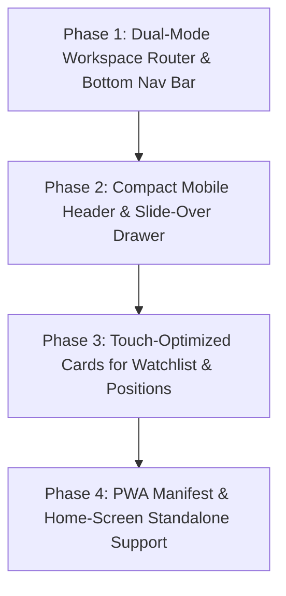

# QUANTPULSE — Mobile-Friendly Architecture & Implementation Blueprint

> **Status:** Architectural Design & Implementation Specification  
> **Target Version:** QuantPulse v2.5.0+  
> **Applies to:** Responsive Layout, Viewport Adapters, Mobile Bottom Navigation, Touch Ergonomics, and Progressive Web App (PWA)

---

## 1. Executive Summary & Objective

The objective of this initiative is to transform **QuantPulse** from a desktop-centric financial workstation into a **hybrid adaptive trading terminal**.

- **On Desktop / Laptop (`≥ 1024px`):** Preserves 100% of the institutional 3-column layout (Zones B, C, D) and bottom execution monitor (Zone E) without visual or functional degradation.
- **On Mobile & Tablets (`< 1024px`):** Provides a fluid, thumb-optimized, native trading app experience (comparable to Zerodha Kite or Dhan Mobile) utilizing focused single-view panels, a fixed bottom navigation bar, and collapsible control drawers.

---

## 2. Current State Assessment vs. Target Mobile Architecture

### Current Mobile Limitations (Before Optimization)

```text
┌─────────────────────────────────────────────────────────┐
│ Zone A: Master Header (Wraps into 6+ tall rows)         │ ◄── Consumes ~50% of mobile screen
├─────────────────────────────────────────────────────────┤
│ Zone B: Watchlist Table (50 rows stacked vertically)    │ ◄── Endless scroll (5,000+ px)
├─────────────────────────────────────────────────────────┤
│ Zone C: Volume Crossover Screener                       │ ◄── Hidden deep down the page
├─────────────────────────────────────────────────────────┤
│ Zone D: Dynamic Next-Action Execution Card              │ ◄── Hard to reach for rapid trade entry
├─────────────────────────────────────────────────────────┤
│ Zone E: Positions & Trailing Stop-Loss (TSL) Monitor    │ ◄── Requires scrolling to page bottom
└─────────────────────────────────────────────────────────┘
```

1. **Header Congestion:** 15+ toggles, clocks, and action buttons wrap into 5–7 vertical rows on screens `< 450px`, pushing trading charts and data below the fold.
2. **Endless Vertical Stacking:** Mobile users must scroll past all 50 watchlist entries just to view the screener or confirm a trade in Zone D.
3. **Data Table Clipping:** Dense financial tables (8+ columns) require awkward horizontal scrolling.
4. **Touch Targets:** Dense desktop buttons (< 30px) can cause accidental taps on mobile touchscreens.

---

### Target Adaptive Layout (Dual-Mode Architecture)

```text
       DESKTOP / LAPTOP (lg: ≥ 1024px)                        MOBILE PHONE (< 1024px)
┌──────────────────────────────────────────────┐       ┌─────────────────────────────────────┐
│ Zone A: Institutional Command Header         │       │ Compact Header (Clock + MTM + Menu) │
├──────────────┬───────────────┬───────────────┤       ├─────────────────────────────────────┤
│ Zone B       │ Zone C        │ Zone D        │       │                                     │
│ Watchlist    │ 20D Screener  │ Next Action   │       │       ACTIVE MOBILE TAB VIEW        │
│ (3 Cols)     │ (6 Cols)      │ (3 Cols)      │       │  [Watchlist | Screener | Trade | Pos]│
├──────────────┴───────────────┴───────────────┤       │  (Full-width focused workstation)   │
│ Zone E: Executed Trades & TSL Monitor        │       │                                     │
└──────────────────────────────────────────────┘       ├─────────────────────────────────────┤
                                                       │ 📋Watchlist  🎯Radar  ⚡Trade  💼Pos│
                                                       └─────────────────────────────────────┘
```

---

## 3. Component-by-Component Responsiveness Specifications

### 3.1 Zone A: Compact Header & Mobile Slide-Over Drawer

- **Mobile Top Bar:**
  - Displays only brand logo (`QUANTPULSE`), Market Status Beacon (🟢 LIVE / 🟡 PRE / 🔴 CLOSED), live IST Clock, and Daily MTM P&L.
  - Hamburger Menu button (`☰`) toggles a full-height slide-over drawer.
- **Mobile Settings Drawer (Slide-Over):**
  - Strategy Switcher (20D Crossover, NIFTY 09:20 Overnight, NIFTY 180 Breakout).
  - Feed Mode selector (Live Dhan vs. Simulator).
  - Trade Mode toggle (Manual vs. Auto Trade).
  - Capital per trade input.
  - Broker Vault, Telegram Alerts, Auto-Pilot, and Cloud Logs buttons.
  - Global Panic Kill Switch.

### 3.2 Main Workspace: Mobile View Router

In `src/app/page.tsx`, introduce a mobile active view state:
```typescript
type MobileTab = 'WATCHLIST' | 'SCREENER' | 'TRADE' | 'POSITIONS';
```

- **Desktop (`hidden lg:grid`):** Renders the full 3-column grid layout as today.
- **Mobile (`block lg:hidden`):** Renders **only the active tab** in full viewport width:
  - `'WATCHLIST'`: Renders Zone B in full-screen focus.
  - `'SCREENER'`: Renders Zone C in full-screen focus.
  - `'TRADE'`: Renders Zone D in full-screen focus.
  - `'POSITIONS'`: Renders Zone E in full-screen focus.

### 3.3 Fixed Mobile Bottom Navigation Bar

A persistent bottom bar anchored at `fixed bottom-0 inset-x-0 z-40 bg-obsidian/95 backdrop-blur border-t border-slate-800`:
- **Tabs (44px Minimum Touch Targets):**
  1. 📋 **Watchlist (Zone B):** Badge showing monitored stock count.
  2. 🎯 **Radar / Screener (Zone C):** Badge showing stocks that crossed 20D today.
  3. ⚡ **Trade (Zone D):** Quick access to order execution for the selected ticker.
  4. 💼 **Positions (Zone E):** Badge showing open position count and net P&L color.
- **Ergonomics:** Designed for single-thumb reachability on one-handed mobile use.
- **Safe Area Inset:** Includes `pb-[env(safe-area-inset-bottom)]` for gesture navigation on modern iOS and Android devices.

### 3.4 Zone B: Touch-Optimized Watchlist Cards

- **Mobile Stock Card Layout:**
  - **Left:** Stock Ticker, Sector / FnO Tag, Security ID.
  - **Right:** Spot LTP, Day Change (₹ and %), Live Feed indicator.
  - **Bottom:** Mini 20D volume progress bar (`Today Volume` vs. `20D Average`).
- **Touch Interaction:** Tapping any stock card automatically selects it and navigates to the ⚡ **Trade** or 🎯 **Radar** view.

### 3.5 Zone D: Mobile Trade Execution & Order Confirmation

- Sticky full-width execution button (`BUY STOCK` / `BUY OPTION`).
- Quantity stepper with quick lot multipliers (`1x`, `2x`, `5x`).
- Risk/Reward pill badges clearly showing ₹ Stop Loss and ₹ Target 1/2/3/4.
- High-contrast visual distinction between Paper mode (`bg-emerald-500`) and Live Dhan mode (`bg-gradient-to-r from-rose-500 to-amber-500`).

### 3.6 Zone E: Mobile Positions & Trailing Stop-Loss Cards

- Each position presented as an interactive mobile card:
  - Symbol & Instrument type.
  - Net P&L in large typography (`+₹4,250.00` green / `-₹1,200.00` red).
  - Trailing Stop Loss milestone progress stepper (`Initial SL ➔ Breakeven ➔ +2R Trail ➔ Target`).
  - 1-Tap **"Square Off"** emergency exit button.

---

## 4. Progressive Web App (PWA) Integration

To provide an app-store-grade native feel without app store distribution:

1. **Web App Manifest (`public/manifest.json`):**
   ```json
   {
     "name": "QuantPulse Trading Terminal",
     "short_name": "QuantPulse",
     "start_url": "/",
     "display": "standalone",
     "background_color": "#0b0f19",
     "theme_color": "#0b0f19",
     "orientation": "portrait-primary",
     "icons": [
       { "src": "/icons/icon-192.png", "sizes": "192x192", "type": "image/png" },
       { "src": "/icons/icon-512.png", "sizes": "512x512", "type": "image/png" }
     ]
   }
   ```
2. **Mobile Viewport & Apple Meta Tags (`src/app/layout.tsx`):**
   - `viewport: width=device-width, initial-scale=1, maximum-scale=1, user-scalable=no, viewport-fit=cover`
   - `apple-mobile-web-app-capable: yes`
   - `apple-mobile-web-app-status-bar-style: black-translucent`
3. **Benefits:**
   - Launches full-screen with no browser search/URL bar.
   - Saves directly to iPhone and Android home screens via "Add to Home Screen".

---

## 5. Touch Ergonomics & Quality Invariants

| Standard | Metric | Rationale |
| :--- | :--- | :--- |
| **Minimum Touch Target** | `44px × 44px` | Complies with Apple HIG and WCAG 2.1 AAA accessibility. |
| **Viewport Overflow** | `overflow-x: hidden` | Eliminates accidental horizontal page shifting on mobile. |
| **Haptic Feedback** | Web Vibration API (`navigator.vibrate(10)`) | Subtle confirmation on order execution and kill switch. |
| **Font Scaling** | `text-xs` (12px) minimum | Prevents iOS Safari automatic zoom on form input focus. |
| **Safe Areas** | `env(safe-area-inset-*)` | Prevents UI clipping behind iPhone notches or home indicator bars. |

---

## 6. Phased Implementation Roadmap



### Phase 1: Dual-Mode Router & Bottom Navigation Bar
- Add mobile navigation state (`activeMobileTab`) in context or local UI state.
- Create `MobileBottomNav.tsx` component with 4 thumb-friendly tabs.
- Configure `page.tsx` so desktop retains the 3-column layout while mobile renders the selected tab.

### Phase 2: Compact Header & Slide-Over Drawer
- Refactor `ZoneA_Header.tsx` to conditionally collapse secondary toggles into a hamburger drawer on screens `< 1024px`.
- Retain essential indicators (clock, live beacon, MTM P&L) in the sticky top bar.

### Phase 3: Touch-Optimized Mobile Cards
- Add mobile card variants for Zone B watchlist rows and Zone E positions.
- Implement horizontal scroll wrappers for dense secondary statistical tables.

### Phase 4: PWA Manifest & App Shell
- Add `manifest.json` and Apple PWA meta tags in `src/app/layout.tsx`.
- Enable standalone home-screen launching on mobile devices.

---

## 7. Responsive Breakpoint Reference Matrix

| Breakpoint | Typical Devices | Layout Behavior |
| :--- | :--- | :--- |
| `< 640px` (Default) | iPhone 13/14/15, Galaxy S22/S23 | Compact Header + Single Tab View + Fixed Bottom Bar |
| `640px – 1023px` (`sm:` / `md:`) | iPad Mini, iPad Air, Surface Go | Compact Header + 2-Column Split or Single Tab View |
| `≥ 1024px` (`lg:`) | MacBook Air, 13"–15" Laptops | Full Institutional 3-Column Desktop Terminal |
| `≥ 1536px` (`2xl:`) | 27"–32" UltraWide Workstations | Full Expanded Desktop Terminal with Enhanced Data Matrix |
